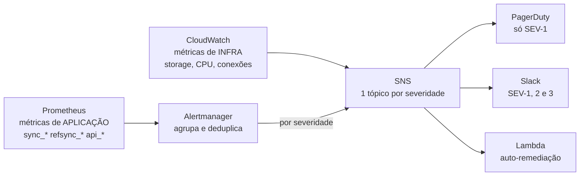

# Alertas — definição, severidade e integração AWS

**PDF § 5.2 B.2** pede no mínimo 5 alertas críticos, cada um com **métrica,
threshold, severidade, ação esperada e como integraria com CloudWatch/SNS**.
São 6 aqui. As regras executáveis estão em
[`init/prometheus/alert_rules.yml`](../../init/prometheus/alert_rules.yml);
este documento é o porquê de cada uma.

---

## Resumo

| # | Alerta | Métrica | Threshold | Sev | Ação |
|---|---|---|---|---|---|
| 1 | Pipeline parado | `sync_last_success_timestamp` **e** `sync_lag_seconds` | > 300s **com** lag > 60s | **SEV-1** | Acorda o plantão |
| 2 | Lag crescente | `sync_lag_seconds` | > 60s por 5 min | SEV-2 | Investiga o consumidor |
| 3 | Erros no pipeline | `sync_errors_total` | qualquer erro em 15 min | SEV-3 | Investiga em horário comercial |
| 4 | Dicionário desatualizado | `refsync_check_age_seconds` | > 900s por 5 min | SEV-3 | Verifica ref-sync e legado |
| 5 | Storage alto | `node_filesystem_avail_bytes` | > 85% de uso por 10 min | SEV-2 | Dispara o [runbook](../runbook.md) |
| 6 | Alvo de coleta fora | `up` | `== 0` por 5 min | SEV-2 | Restaura a coleta |

**Calibragem de severidade** — SEV-1 acorda gente às 3h; SEV-2 é o mesmo dia;
SEV-3 espera o horário comercial. Alerta que dispara demais é alerta ignorado, e
fadiga de alerta é falha de projeto, não de quem está de plantão. Por isso só
**um** dos seis é SEV-1.

---

## 1. Pipeline parado — SEV-1

| Campo | Valor |
|---|---|
| **Métrica** | `time() - sync_last_success_timestamp` **e** `sync_lag_seconds` |
| **Threshold** | sem gravar há > 300s **com** lag > 60s, por 1 min |
| **Severidade** | SEV-1 — acorda o plantão |
| **Ação esperada** | Abrir [`incident-response.md`](../incident-response.md) e seguir a linha de investigação dos 5 minutos |
| **CloudWatch/SNS** | Regra do Prometheus → Alertmanager → tópico SNS `trio-sev1` → PagerDuty (plantão) + Slack `#incidentes`. Em produção o mesmo sinal vira `PutMetricAlarm` no CloudWatch sobre a métrica customizada `Trio/Pipeline/SecondsSinceLastSuccess`, publicada via `PutMetricData` pelo próprio worker |

**Por que é o alerta mais importante do conjunto.** É o que detecta o cenário
SEV-1 do PDF § 5.2 C — dashboards de Pix zerados por 2h, transações sendo
processadas normalmente na origem — em **5 minutos em vez de 2 horas**.

"Volume zero no dashboard" é ambíguo: pode ser madrugada, pode ser feriado.
"O pipeline não grava há 5 minutos **e há dado esperando**" só tem uma leitura.
O princípio: **alerte sobre o sintoma que só tem uma causa possível.**

**Por que a condição é dupla — e isto não é detalhe de implementação.** A versão
óbvia seria:

```promql
time() - sync_last_success_timestamp > 300     # ERRADO sozinho
```

O `sync-worker` só registra ciclo de **sucesso** quando há linha nova para
gravar. Com o banco ocioso — noite, fim de semana, ambiente de homologação — o
intervalo entre sucessos passa de 300s naturalmente, **sem defeito nenhum**.
Esse alerta acordaria o plantão toda madrugada até alguém silenciá-lo, e um
alerta silenciado não detecta o incidente que ele existe para pegar.

O segundo termo (`sync_lag_seconds > 60`) exige que haja **trabalho represado**.
"Não grava há 5 min" + "há dado esperando" = quebrou. "Não grava há 5 min" +
"não há nada para gravar" = está tudo bem.

> Comportamento observado na prática: o teste `E2.4` do `run_all.sh` falhava de
> forma intermitente exatamente por isso, com o worker íntegro. O falso positivo
> foi medido antes de o alerta ser escrito, não previsto no papel.

## 2. Lag crescente — SEV-2

| Campo | Valor |
|---|---|
| **Métrica** | `sync_lag_seconds` |
| **Threshold** | > 60s por 5 min (alvo de freshness é < 30s) |
| **Severidade** | SEV-2 — mesmo dia, não de madrugada |
| **Ação esperada** | Abrir o dashboard *Trio · Pipeline*: duração do ciclo subindo indica origem lenta; lote no teto (50k) indica volume acima da capacidade do ciclo |
| **CloudWatch/SNS** | SNS `trio-sev2` → Slack `#dados-operacao`. Sem PagerDuty: ainda está gravando |

Ainda funciona, mas está ficando para trás. É o **aviso que antecede o alerta
nº 1** — pegar aqui é resolver antes de virar incidente.

## 3. Erros no pipeline — SEV-3

| Campo | Valor |
|---|---|
| **Métrica** | `increase(sync_errors_total[15m])` |
| **Threshold** | > 0 |
| **Severidade** | SEV-3 — horário comercial |
| **Ação esperada** | Verificar a categoria no label `type`; o retry exponencial pode estar absorvendo sem impacto visível |
| **CloudWatch/SNS** | SNS `trio-sev3` → Slack `#dados-avisos`, agrupado a cada 1h para não poluir |

Substitui o alerta de **DLQ** previsto na especificação original: a
dead-letter queue era do consumidor CDC, que saiu do caminho principal quando o
Debezium foi descartado (ver `desafio-2/ADR.md`). O papel — "algo falha de forma
recorrente, alguém precisa olhar sem urgência" — é coberto por
`sync_errors_total`, que o sync-worker expõe por categoria.

## 4. Dicionário desatualizado — SEV-3

| Campo | Valor |
|---|---|
| **Métrica** | `refsync_check_age_seconds` — idade da última **verificação**, não do dado |
| **Threshold** | > 900s (15 min = 3 ciclos perdidos) por 5 min |
| **Severidade** | SEV-3 |
| **Ação esperada** | Verificar o container `ref-sync` e a conectividade com o legado |
| **CloudWatch/SNS** | SNS `trio-sev3` → Slack `#dados-avisos` |

O `dict_institutions` alimenta a decisão de roteamento da API. Desatualizado
significa decidir com cadastro velho. **3 ciclos, não 1:** um ciclo falho é
ruído (o retry cobre), três seguidos é padrão.

### A métrica que este alerta NÃO usa, e por quê

A primeira versão media `refsync_dictionary_age_seconds` — segundos desde o
`max(updated_at)` do legado. **Era falso positivo permanente**, e foi encontrado
com o ambiente rodando: num legado que não muda, essa série cresce
indefinidamente enquanto o `ref-sync` verifica pontualmente a cada 5 min
(`docker logs trio-ref-sync` mostrando `unchanged`).

O defeito mais grave não é o falso positivo. É que, se o worker **morresse**, a
série congelaria no último valor em vez de continuar crescendo — ela dispara
igual no caso bom e no ruim, e portanto **não distingue nada**.

`refsync_check_age_seconds` mede a idade da última verificação bem-sucedida, é
avaliada a cada scrape, e cresce exatamente quando o worker para de checar. É a
mesma escolha de `sync_last_success_timestamp` no pipeline principal: **medir
progresso, não ausência de mudança**.

As duas séries continuam existindo, porque respondem perguntas diferentes:

| Série | Responde | Serve para |
|---|---|---|
| `refsync_dictionary_age_seconds` | "o cadastro que a API lê está velho?" | Painel |
| `refsync_check_age_seconds` | "o worker ainda está checando?" | **Alerta** |

**Divisão com o alerta nº 6** (`AlvoDeColetaFora`), verificada em teste: com o
container parado a série some — não há quem raspar — e quem dispara é o nº 6.
Com o processo vivo e travado, a série cresce e é este alerta que pega. Os dois
juntos cobrem o espaço; nenhum sozinho cobriria.

Vale notar o que **não** é: o `LIFETIME(MIN 240 MAX 360)` do Dictionary recarrega
sozinho mesmo com o `ref-sync` fora do ar. Este alerta pega o caso em que a
recarga automática **também** falhou — legado inacessível, credencial expirada.

## 5. Storage alto — SEV-2

| Campo | Valor |
|---|---|
| **Métrica** | `(1 - node_filesystem_avail_bytes / node_filesystem_size_bytes) * 100` |
| **Threshold** | > 85% por 10 min |
| **Severidade** | SEV-2 |
| **Ação esperada** | Executar [`desafio-3/runbook.md`](../runbook.md) — sanitização de chunks antigos |
| **CloudWatch/SNS** | Em produção esta métrica é **nativa do CloudWatch** (`FreeStorageSpace` do RDS/Aurora, `DiskSpaceUtilization` do EC2), não do Prometheus. Alarme do CloudWatch → SNS `trio-sev2` → Slack. É o exemplo mais claro da divisão: **infra vem do CloudWatch, aplicação vem do Prometheus** |

**Por que 85% e não 92%.** O cenário do PDF descreve storage em 92%, e a
sanitização exige **descomprimir o chunk antes** de sanitizar — o que precisa de
espaço livre, justamente o que falta. Alertar só a 92% é alertar quando a saída
mais barata já fechou. 85% dá margem para o procedimento ainda ser executável.

> Neste ambiente Docker não há `node_exporter`, então a série
> `node_filesystem_*` não é coletada e a regra fica sem dado — carregada e
> válida, nunca disparando. A decisão foi manter a expressão que valeria em
> produção em vez de trocá-la por um proxy local que não se pareceria com o
> alvo real. É a única das 6 sem série ativa neste ambiente.

## 6. Alvo de coleta fora — SEV-2

| Campo | Valor |
|---|---|
| **Métrica** | `up` (gerada pelo próprio Prometheus por alvo) |
| **Threshold** | `== 0` por 5 min |
| **Severidade** | SEV-2 |
| **Ação esperada** | Verificar o container do alvo e a rede entre ele e o Prometheus |
| **CloudWatch/SNS** | SNS `trio-sev2` → Slack. Em produção o equivalente é o alarme de `HealthyHostCount` do target group, mais `INSUFFICIENT_DATA` tratado como estado acionável, não ignorado |

Substitui o alerta de **slot de replicação** da especificação original, que só
fazia sentido com CDC no caminho: sem slot, não há WAL represado por um
consumidor ausente.

O risco equivalente no desenho atual é mais simples e mais comum: **o alvo de
métricas cai e cega todos os outros alertas** — inclusive o nº 1, que é o que
protege o pipeline. Um alerta que morre em silêncio é pior que a ausência de
alerta, porque cria a impressão de cobertura. Este é o alerta que vigia o
próprio sistema de alertas.

---

## Integração com AWS — o desenho completo



**A divisão que sustenta o desenho:** métrica de **infraestrutura** (storage,
CPU, IOPS, conexões do RDS) vem do CloudWatch, que já as coleta sem custo de
instrumentação. Métrica de **aplicação** (`sync_last_success_timestamp`,
`refsync_dictionary_age_seconds`) o CloudWatch não tem como saber — vem do
Prometheus. Os dois convergem no SNS, que roteia por severidade.

| Tópico SNS | Assinantes | Origem típica |
|---|---|---|
| `trio-sev1` | PagerDuty (plantão 24×7) + Slack `#incidentes` | Alertmanager |
| `trio-sev2` | Slack `#dados-operacao` + e-mail do time | Alertmanager e CloudWatch |
| `trio-sev3` | Slack `#dados-avisos`, agrupado por hora | Alertmanager |

**Auto-remediação (a Lambda do diagrama).** Alguns alertas têm resposta
mecânica e previsível: reiniciar uma task de ECS que morreu, forçar
`SYSTEM RELOAD DICTIONARY`. A Lambda executa a ação e **registra que executou**;
se o mesmo alerta reincidir em curto intervalo, ela para de remediar e escala
para humano. Remediação automática que esconde um problema recorrente troca um
incidente visível por uma degradação silenciosa.

**O que publica as métricas de aplicação no CloudWatch.** Duas opções, e a
escolha depende do volume: `PutMetricData` direto do worker (simples, custa por
chamada) ou o **CloudWatch Agent com o receiver Prometheus**, que faz scrape do
`/metrics` que já existe e republica. A segunda preserva o formato atual — os
mesmos dashboards e as mesmas expressões continuam valendo.

---

## Como estas regras são testadas

Existir, carregar e estar saudável são três propriedades que o
`DicionarioDesatualizado` cumpria **enquanto media a série errada**. Por isso há
teste unitário das regras, não só da presença delas:

```bash
bash scripts/tests/alertas-test.sh
```

`promtool test rules` avalia cada regra contra séries sintéticas com **tempo
simulado** — é o que torna viável exercitar um `for: 10m` em milissegundos, e
testar cenários (worker morto, erro no pipeline, alvo fora) sem quebrar nada no
ambiente real.

São **11 casos** em `init/prometheus/alert_tests.yml`, e cada regra tem os dois
lados:

| Regra | Dispara quando | E fica quieta quando |
|---|---|---|
| PipelineParado | Sem gravar **e** com lag | Sem gravar **sem** lag (ocioso) |
| LagCrescente | Lag 90 s, após o `for: 5m` | Lag 10 s, dentro do alvo |
| ErrosNoPipeline | Contador subindo | Contador parado em zero |
| DicionarioDesatualizado | `check_age` crescendo | Worker checando em legado estático |
| AlvoDeColetaFora | `up == 0` | `up == 1` |

**O par negativo importa tanto quanto o positivo.** O caso
"DicionarioDesatualizado NÃO dispara com worker saudável em legado estático" é
literalmente o falso positivo que existia — reverter o alerta para a métrica
antiga faz **os dois** casos dessa regra falharem, verificado por teste de
mutação.
